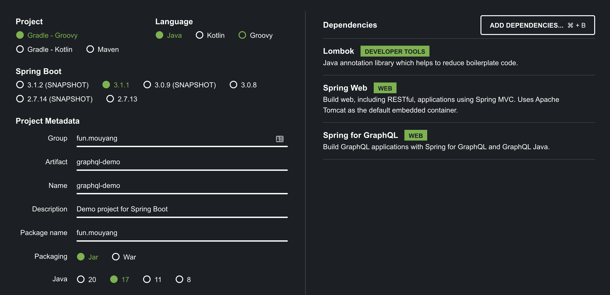
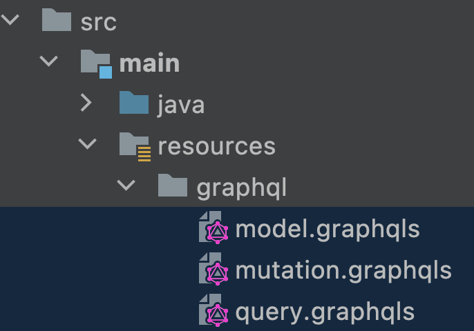
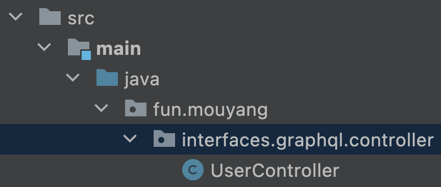

# graphql-demo
Describe how to generate GraphQL API interfaces using GraphQL schemas.

---

## 1. Create a new Spring Project using Spring Initializr
Provide the configuration in the below image.


## 2. Create "GraphQL schemas" in /src/main/resources/graphql


---
## 3. Update build.gradle
### 3-1. Adjust the dependencies block to make it more clear and readable
```groovy
dependencies {
    // spring
    implementation 'org.springframework.boot:spring-boot-starter-web'
    implementation 'org.springframework.boot:spring-boot-starter-graphql'

    // lombok
    compileOnly 'org.projectlombok:lombok'
    annotationProcessor 'org.projectlombok:lombok'

    // test
    testImplementation 'org.springframework.boot:spring-boot-starter-test'
    testImplementation 'org.springframework.graphql:spring-graphql-test'
}
```

### 3-2. Add [graphql java codegen plugin](https://github.com/kobylynskyi/graphql-java-codegen/tree/main/plugins/gradle) to plugin block
```groovy
plugins {
	id 'java'
	id 'org.springframework.boot' version '3.1.1'
	id 'io.spring.dependency-management' version '1.1.0'
	id "io.github.kobylynskyi.graphql.codegen" version "5.7.2"
}
```

### 3-3. Set the [configuration parameters](https://github.com/kobylynskyi/graphql-java-codegen/blob/main/docs/codegen-options.md) for the graphqlCodegen task provided by the plugin
Parameters contain the location of graphql schemas, output directory, and the package name for the generated interface and model.
```groovy
graphqlCodegen {
    graphqlSchemas.rootDir = file("${projectDir}/src/main/resources/graphql").toString()
    outputDir = file("${buildDir}/generated/graphql")
    apiPackageName = 'fun.mouyang.interfaces.graphql.controller'
    modelPackageName = 'fun.mouyang.interfaces.graphql.dto'
    generateToString = true
    generateEqualsAndHashCode = true
}
```

### 3-4. Add the directory that contains the generated interface and model to the project source sets
```groovy
sourceSets {
    main {
        java {
            srcDir 'src/main/java'
            srcDir "${buildDir}/generated/graphql"
        }
    }
}
```

### 3-5. Execute the graphqlCodegen task during gradle build process
```groovy
compileJava.dependsOn tasks.graphqlCodegen
```

---

## 4. Create [UserController](src/main/java/fun/mouyang/interfaces/graphql/controller/UserController.java) in fun.mouyang.interfaces.graphql.controller


---

## 5. Enable graphiql for interactively exploring the GraphQL API
```properties
# GraphQL
spring.graphql.graphiql.enabled = true
spring.graphql.graphiql.path = /graphiql
spring.graphql.schema.locations = classpath:graphql
```